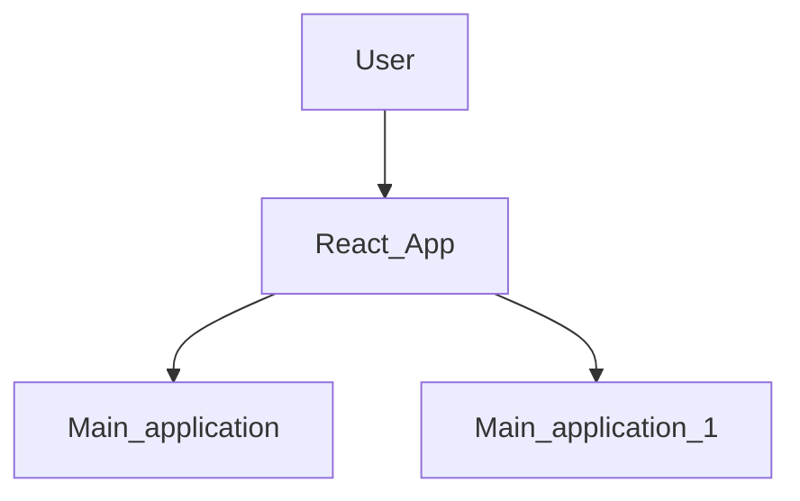

```
Develop By Manu Pathak .
If any Body want to help for Projects than contact me .


```
Author : Manu Pathak
[www.javatech4u.com](www.javatech4u.com)
Email : [pathakmanu6395@gmail.com](pathakmanu@gmail.com)


#  Ecommerce Application Documentation

## Project title : Shopsy - Begin the Shopping
Modular, Scalable, and Customizable ERP built using React, Spring Boot, and MySQL, MongoDB and Micro-Service.

##### Table of Contents
1. [Project Overview](#project-overview)  
2. [Features and Application](#features)  
3. [Tech Stack](#tech-stack) 
4. [Installation and setup](#-database-design)
4. [Architecture Diagram](#architecture-diagram)
4. [Security](#-database-design)
4. [Requirement](#-database-design)
4. [Systen Design](#-database-design)
4. [Hardware and Software,Libaries and Module](#-database-design)
4. [Tools and Platform](#-database-design)
5. [Module Breakdown](#module-breakdown)  
6. [Database Design (DFD , ER-Diagram , UML)](#database-design)  
7. [Propesed and Methodology](#installation-guide)  
8. [Design and Development](#api-documentation)
8. [API Documentation](#api-documentation)
9. [Result](#security)   
11. [Future Improvements](#future-improvements)  
12. [Screenshots / Demo](#screenshots--demo)
---

### 1. Project Overview
This ERP system centralizes and streamlines business operations such as **Inventory Management**, **Sales & Purchases**, **Customer Handling**, **User Roles**, and **Finance Tracking**. Designed for SMEs, it is modular, responsive, and built on a RESTful architecture.

---
### 2. Features
- Product Management
- Shopping Features
- Checkout & Payment
- Order & Delivery
-  Support & Notifications
- Admin Panel
- AI Features in E-Commerce
   - Product Recommendation Engine
   -  Smart Search with NLP
   - Visual Search
   - AI Chatbot for Customer Support
   - Dynamic Pricing
   - Personalized UI/UX
   -  Demand Forecasting
   - Email/Notification Targeting
   - Sales Analytics & Prediction
- 🤖 **AI-Powered Features for ERP Applications**
     - _Smart Analytics & Forecasting_
     - Sales Forecasting
     - Inventory Demand Prediction
     - Expense Pattern Detection
     - Intelligent Recommendations
        - Purchase Suggestions
        - Product Bundle Recommendations
        - Dynamic Discounting
        - Product Image Classification
        - Auto-Scheduling Orders & Reminders
        - AI-Based Email/SMS Reminders
        - Voice Alert Assistant
        - AI-Powered KPI Suggestions
    - Natural Language Processing (NLP)
      - Chatbot for Admin Queries
      - Voice-to-Text for Invoicing
      - Smart Search Suggestions
    - Security & Anomaly Detection
      - Login Anomaly Detection
      - Fraud Detection in Transactions
      - Face Recognition Login 
- 🔐 **User Account Management**
    - Role-Based Access Control (RBAC): Admin, Manager, Staff
    - JWT-based Authentication System
    - Secure Login with Password Hashing (BCrypt)
    - Session Expiry and Token Validation
    <br>
- 📦 **Inventory & Stock Tracking**  
     - Add / Update / Delete Products and Categories
     - Real-time Stock Level Tracking
     - Low-Stock Notifications and Threshold Alerts
     - Barcode/QR Code Integration (optional)
     - Unit Management (kg, liter, pcs etc.)
<br>
-  **Product Variants (size, color, etc.)**
    - Add product and Perform CURD Options and Analysis
    - Management of Product
- **Sales & Purchase Reports with GST integration**
    - Add/Edit/Delete Sales Orders
    - Real-Time Sales Dashboard
    - Discount, Tax (GST), and Coupon Management
    - PDF Invoice Generation
    - Daily,Weekly, and Monthly Sales Reports

- **Payment Mode Tracking** (Cash, UPI, Bank Transfer)
   - UPI Payment Intregation
   - Bank Transfer 
   - RazorPay

- 🧾 **Invoice Generation & PDF Export** 
    - Invoice and PDF Management <br>
- 👥 **Customer & Supplier Management**  
- 🧑‍💼 **HRM: Employee CRUD + Attendance**  
- ⚙️ **Configurable Tax, Discounts, Payment Modes**  
- 🌗 **Light/Dark Theme Toggle (React UI)** 
- 🛠 **REST APIs for mobile app integration**

---

### 🧰 Tech Stack


| Layer           | Technology                |
|----------------|---------------------------|
| Frontend       | React.js, Tailwind CSS    |
| Backend        | Node.js / Spring Boot     |
| Database       | MongoDB / MySQL           |
| Auth           | JWT, Google/Firebase Auth |
| AI             | LLMs (LLaMA, GPT), Python  |
| Deployment     | Netlify (FE), Render / Railway (BE) |
| Other Tools    | Stripe/Razorpay, Docker   |


## Installation

For Frontend
```
git clone https://github.com/manu367/erp_coach.git
cd erp_coach
npm install
```
Go to Backend and Setup 
```
cd backend
open backend code in intillij idea
maven clean and install
set up application.properties
```
application.properties
```
server.port= user_according
spring.datasource.url=jdbc:DATABASE_NAME://URL:PORT
spring.datasource.username=user_name
spring.datasource.password=Password
spring.datasource.driver-class-name=org.postgresql.Driver (add lastest Driver)
google.client-id= add your client id
google-secrent-id= add your secret id

Jwt-token= ADD_TOKEN_According by you
```


### Architecture Diagram




#### 🧩 Module Breakdown

### 1. Authentication & Authorization
- JWT Token-based login system  
- User roles: Admin | Manager | Staff  
- Passwords hashed using BCrypt  

### 2. Inventory Module
- CRUD operations for products  
- Category/Subcategory based filtering  
- Stock alerts when quantity is low  

### 3. Sales & Purchase
- Order processing with tax, discount, payment  
- Daily/Monthly reporting  
- Export to PDF  

### 4. Customer/Supplier
- Contact info, GST number, history of transactions  
- Smart search & sorting  

### 5. HRM Module (Optional)
- Employee registration  
- Daily attendance log  
- Leave tracker  

---

## 🧬 Database Design

### Tables:

- `users` (id, name, email, password, role)  
- `products` (id, name, price, category, stock, created_at)  
- `categories` (id, name, parent_id)  
- `orders` (id, customer_id, total_amount, date, status)  
- `order_items` (order_id, product_id, quantity, price)  
- `customers` (id, name, email, gst, phone)  
- `suppliers` (id, name, contact)  
- `employees` (id, name, position, joined_on)  

### Relationships:

- One order → many order items  
- One product → many categories  
- One user → one role  

---

## ⚙️ Installation Guide

### Frontend (React)

```bash
cd frontend
npm install
npm run dev
```


---


